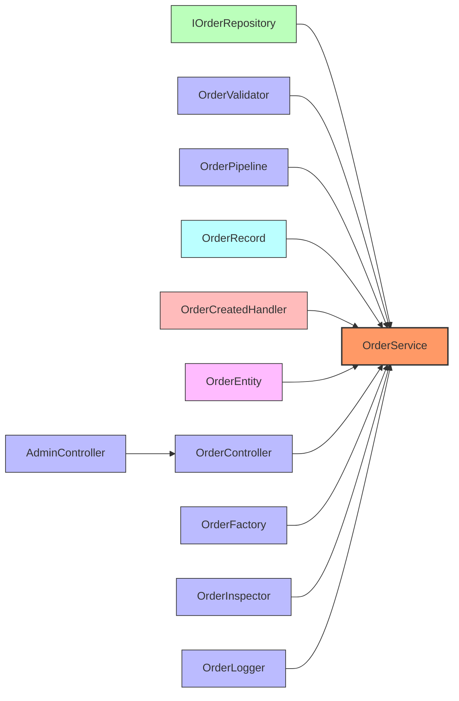

# Dependency Analysis Report

## Target: `SampleApp.Core.OrderService`

## Date: 2026-04-14 13:19:46 UTC

## Fan-In Elements

| # | Fully Qualified Name | Kind | Justification |
|---|----------------------|------|---------------|
| 1 | `SampleApp.Core.IOrderRepository` | Interface | Generic type argument `OrderService` |
| 2 | `SampleApp.Core.OrderCreatedHandler` | Delegate | Delegate parameter type `OrderService` |
| 3 | `SampleApp.Core.OrderRecord` | Record | Record primary constructor parameter type `OrderService` |
| 4 | `SampleApp.Core.OrderValidator` | Class | Field type `OrderService` |
| 5 | `SampleApp.Data.OrderEntity` | Struct | typeof() expression `OrderService` |
| 6 | `SampleApp.Services.AdminController` | Class | Inherits from `OrderController` (which is a transitive fan-in of `OrderService`) |
| 7 | `SampleApp.Services.OrderController` | Class | Field type `OrderService` |
| 8 | `SampleApp.Services.OrderFactory` | Class | Method return type `OrderService` |
| 9 | `SampleApp.Services.OrderInspector` | Class | Type check (is/as) `OrderService` |
| 10 | `SampleApp.Services.OrderLogger` | Class | Local variable type `OrderService` |
| 11 | `SampleApp.Services.OrderPipeline` | Class | Constructor parameter type `OrderService` |

## Metrics

| Kind | Count |
|------|-------|
| Class | 7 |
| Interface | 1 |
| Struct | 1 |
| Record | 1 |
| Delegate | 1 |
| **Total** | **11** |
| **Max Transitive Depth** | **2** |

## Dependency Graph

